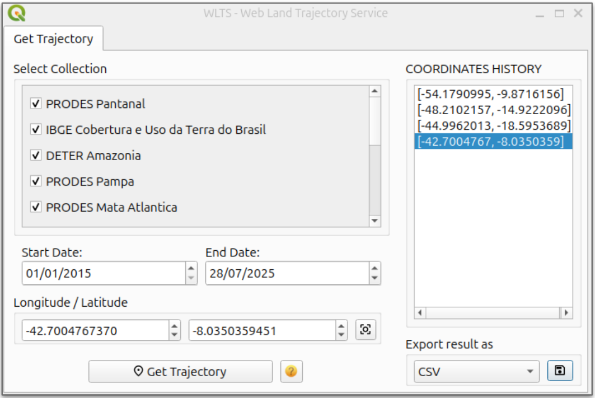
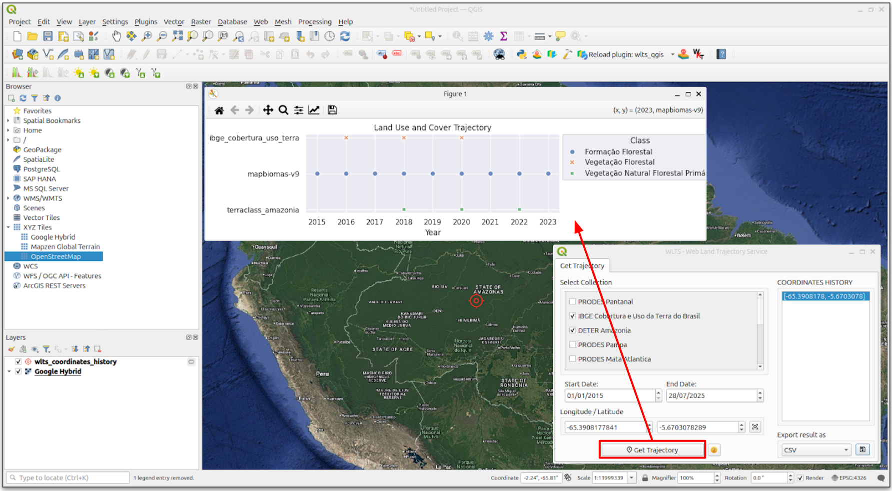

..
    This file is part of Python QGIS Plugin for WLTS.
    Copyright (C) 2025 INPE.

    This program is free software: you can redistribute it and/or modify
    it under the terms of the GNU General Public License as published by
    the Free Software Foundation, either version 3 of the License, or
    (at your option) any later version.

    This program is distributed in the hope that it will be useful,
    but WITHOUT ANY WARRANTY; without even the implied warranty of
    MERCHANTABILITY or FITNESS FOR A PARTICULAR PURPOSE. See the
    GNU General Public License for more details.

    You should have received a copy of the GNU General Public License
    along with this program. If not, see <https://www.gnu.org/licenses/gpl-3.0.html>.

====================
WLTS Plugin Overview
====================

The figure below shows the WLTS Plugin interface. This interface contains a list of available data collections for selection, where some are preselected by default, two fields for entering the start and end dates of the trajectory period, and fields for entering the geographic coordinates (longitude and latitude) that represent the selected point. On the left, there is a list with the history of selected coordinates, allowing the user to compare different locations.

Just below, options are available to save the results in different file formats: CSV, JSON, and Python script. The option to save as a Python script provides the user with the code to reproduce the request and obtain the same chart with the selected attributes in another tool with a Python interpreter, such as Jupyter Lab.

To display the trajectory chart, it is necessary to select the coordinate and click the “Get Trajectory” button. A window will then open with the retrieved data.

================================
Retrieve and Export Trajectories
================================

In the example below, a query is performed from a selected coordinate ``-65.3908, -5.6703``, located in a region of the Brazilian Amazon biome. The datasets from IBGE, DETER Amazônia, and MapBiomas were selected for the years 2015 to 2025. The figure shows the resulting chart of the retrieved trajectory.

